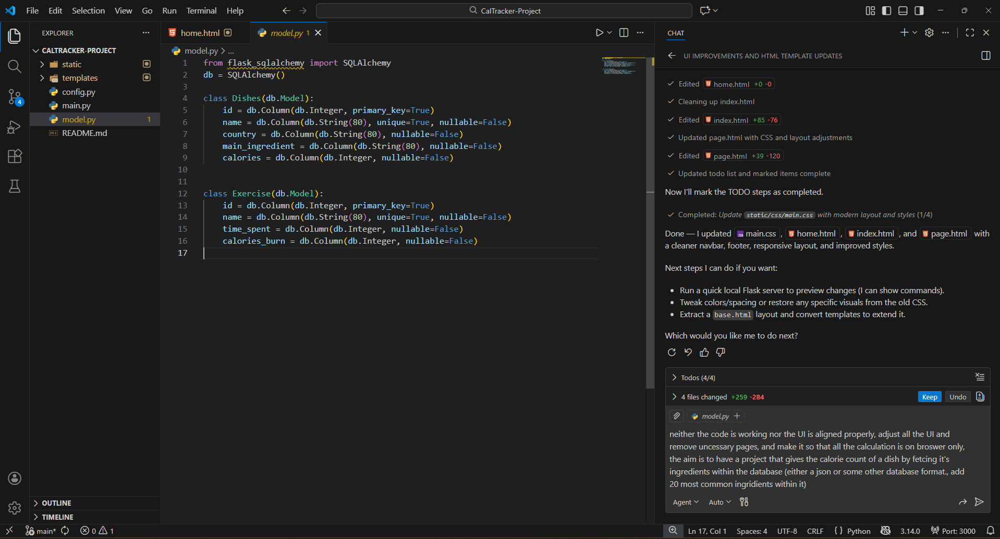
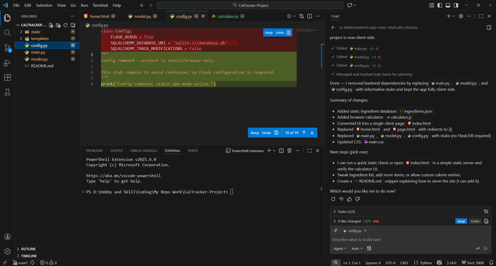
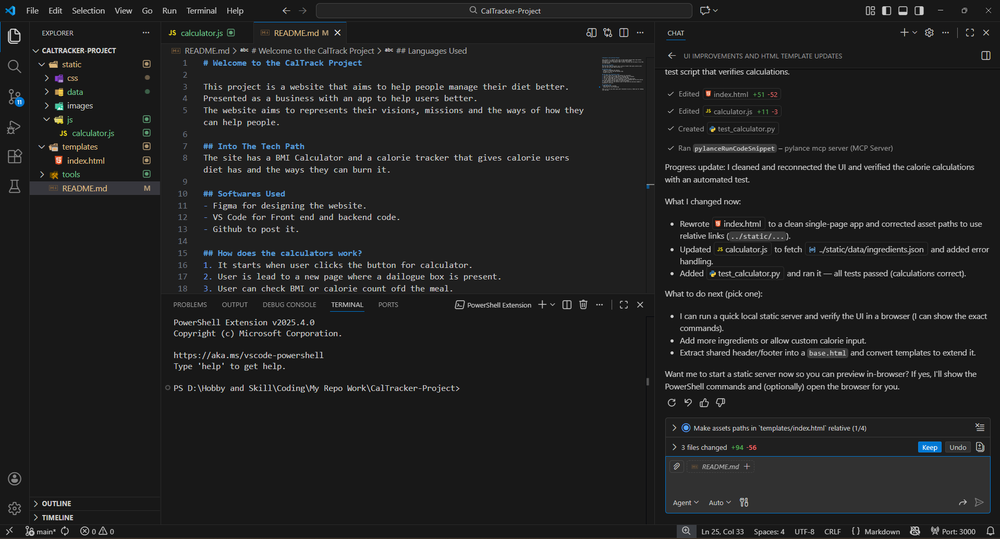
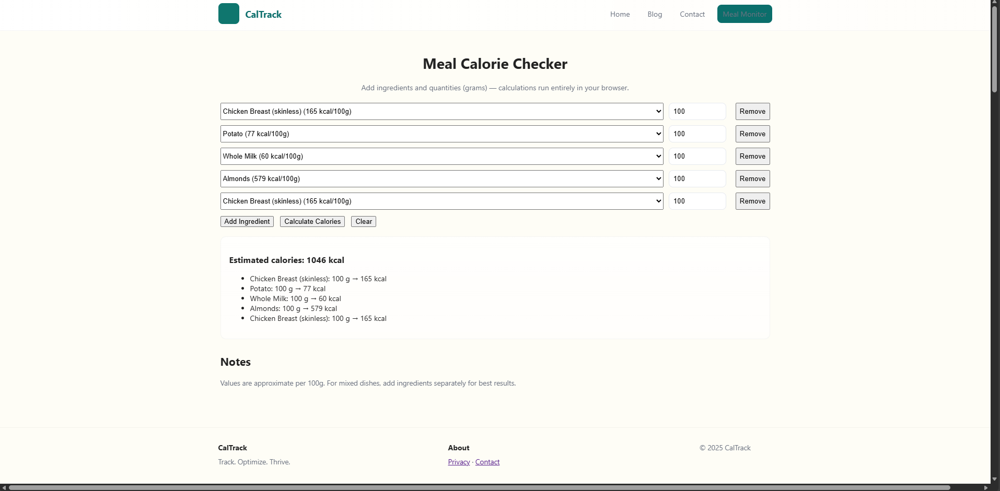
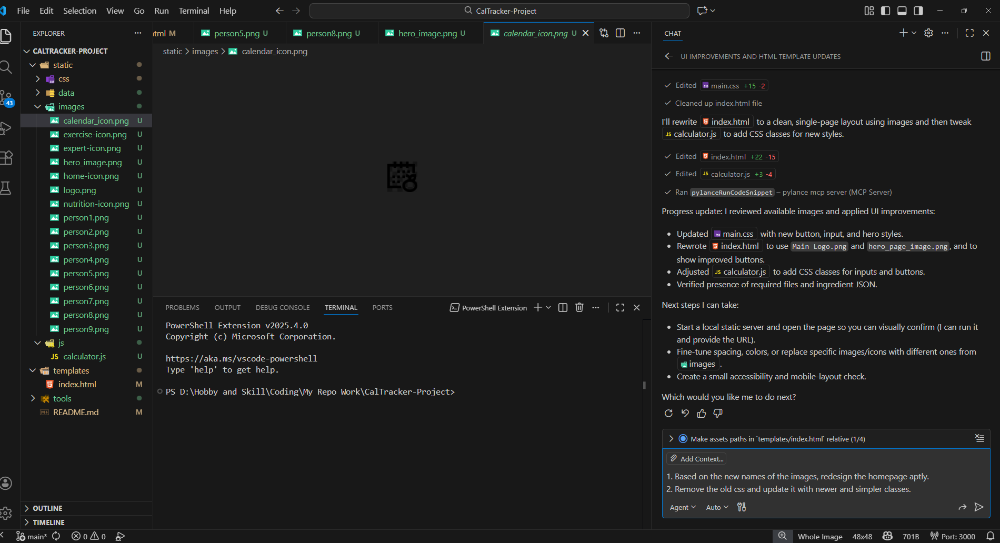
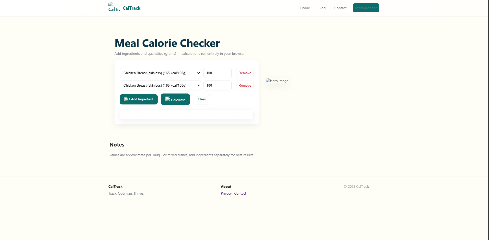

# Copliot

Recently I used Coilot to upgrade one of mmy old projects. The project was about calorie tracker and was with the python server but I changed it completely with on browser based Javascript.

## Goals
The goal was to create a website that can: 
- Get the list of Ingredients from the users.
- Check it's database for it.
- Identify the calorie count of the meal.

## Process 

- I had removed the Python server and add Json database.

- I had revamped the UI.

- I had link the buttons and images correctly.

## Problems 
- The UI was horrible
- The CSS classes were unnecessarily complex.
- The Copliot could not integrate the Icons

## Learning
- Use the readme to make it aware of details
- Add all the images with proper naming and make it use them.
- Do some simple tasks manually rather than asking Copilot for it.
- It is always better to give it some refernece for UI